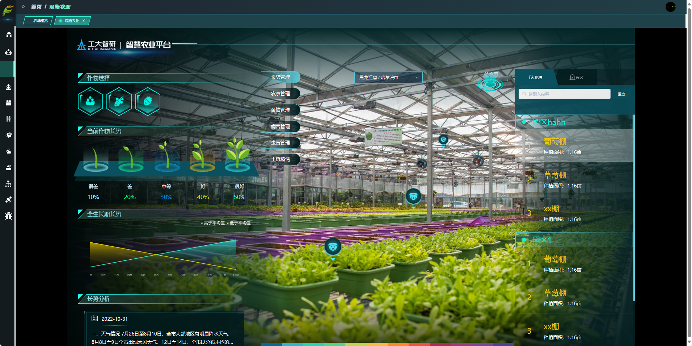

<h1 align="center" style="margin: 30px 0 30px; font-weight: bold;">智农伴飞开放平台</h1>
<h4 align="center">基于SpringBoot+Vue前后端分离的农业平台</h4>

## 平台简介

智农伴飞是一套全部开源的农业平台，毫无保留给个人及企业免费使用。

* 前端采用Vue3、Element UI。
* 后端采用Spring Boot、Spring Security、Redis & Jwt。
* 权限认证使用Jwt，支持多终端认证系统。
* 支持加载动态权限菜单，多方式轻松权限控制。

## 内置功能

1. 用户管理：用户是系统操作者，该功能主要完成系统用户配置。
2. 部门管理：配置系统组织机构（公司、部门、小组），树结构展现支持数据权限。
3. 岗位管理：配置系统用户所属担任职务。
4. 菜单管理：配置系统菜单，操作权限，按钮权限标识等。
5. 角色管理：角色菜单权限分配、设置角色按机构进行数据范围权限划分。
6. 字典管理：对系统中经常使用的一些较为固定的数据进行维护。
7. 参数管理：对系统动态配置常用参数。
8. 操作日志：系统正常操作日志记录和查询；系统异常信息日志记录和查询。
9. 登录日志：系统登录日志记录查询包含登录异常。
10. 在线用户：当前系统中活跃用户状态监控。
11. 系统接口：根据业务代码自动生成相关的api接口文档。
12. 在线构建器：拖动表单元素生成相应的HTML代码。
13. 连接池监视：监视当前系统数据库连接池状态，可进行分析SQL找出系统性能瓶颈。

## 后端部署
1. 准备工作
* JDK >= 11 (推荐11)
* Mysql >= 5.7.0 (推荐5.7版本)
* Redis >= 3.0
* Maven >= 3.0

2. 前往Gitee下载页面（xxxxxx）下载解压到工作目录
* 1、导入到Eclipse，菜单 File -> Import，然后选择 Maven -> Existing Maven Projects，点击 Next> 按钮，选择工作目录，然后点击 Finish 按钮，即可成功导入。
  Eclipse会自动加载Maven依赖包，初次加载会比较慢（根据自身网络情况而定）
* 2、创建数据库（xxxxx）并导入数据脚本SQLxxx1，SQLxxx2
* 3、打开项目运行com.airohit.agriculture.module.server.ServerApplication.java

## 前端部署
  >[前端文档](agriculture-ui/README.md)
## 相关环境的部署

1. 系统环境
   >[部署文档](DEPLOY.md)
   
2. 必要配置
* 修改数据库连接  
  agriculture-admin-server/src/main/resources/bootstrap-dev.yml 
  >
* 修改服务器配置 
  agriculture-admin-server/src/main/resources/bootstrap-dev.yml
  >
* 修改天气接口配置  
  agriculture-admin-server/src/main/resources/bootstrap.yml
  >
* 环境变量
  agriculture-admin-server/src/main/resources/bootstrap-dev.yml
  >
  
  
## 系统截图
* 
* 
* 
* 
* 
* 
* 

