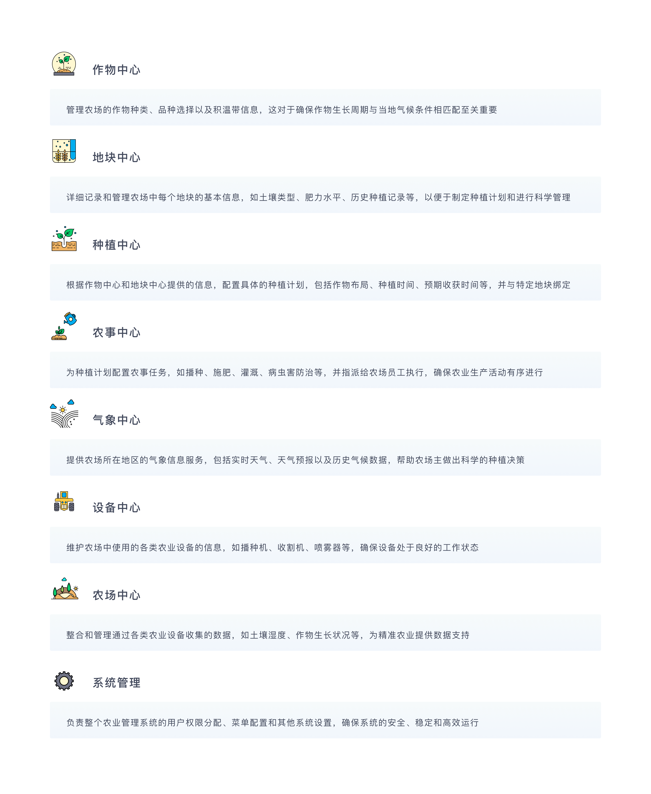

<h1 align="center" style="margin: 30px 0 30px; font-weight: bold;">智农伴飞开放平台</h1>
<h4 align="center" style="font-size: 18px;">基于SpringBoot+Vue前后端分离的智慧农业平台</h4>

## 系统简介
<p style="font-size: 16px;">&nbsp;&nbsp;&nbsp;&nbsp;&nbsp;&nbsp;&nbsp;为全面贯彻习近平总书记农业强国的总体战略要求，根据《国家新一代人工智能发展试验区规划》文件指示及《国家新一代人工智能开放创新平台建设工作指引》的要求，哈尔滨工业大学人工智能研究院有限公司（以下简称“工大智研”）经过前期积极的筹备申报，于2022年11月获得科学技术部正式批复牵头建设“智能农场国家新一代人工智能开放创新平台”即智农伴飞平台（以下简称“平台”）。平台对标百度自动驾驶、京东物流、科大讯飞智能语音等国家级创新平台，成为唯一一个国家战略上的数字农业创新平台，开创了东北地区的先例，填补了智慧农业平台建设领域的空白。</p>
<p style="font-size: 16px;">&nbsp;&nbsp;&nbsp;&nbsp;&nbsp;&nbsp;&nbsp;工大智研致力将智农伴飞平台打造成为覆盖智能农场核心功能，深度挖掘数据核心价值的新一代开放创新平台。平台集云端AI赋能、边缘AI应用场景服务、农学知识图谱和智能农场典型的示范应用等多功能于一体，开源开放数据标准，通过搭建“空天地”一体化多模态农场监测通信与网络、农机自动驾驶与装备自主作业、云边端协同智能认知决策与调度等系统，全面提升农业科技创新能力，实现人工智能赋能农业领域。以需求为导向、产出为目标，推动人工智能技术持续创新并与农业生产各环节深度融合，实现农业领域环境感知的全面化、数据采集的精准化、信息传输的无线化、设备控制的智能化，为有效推动农业增效、农民增收、农产品安全、乡村振兴提供重要科技支撑。</p>

<p align="center" >

</p >

## 系统亮点

## 运行环境
1. JDK 11 (推荐11)
2. Mysql 5.7.0 (推荐5.7版本)
3. Redis 3.0
4. RocketMq 4.4.0
5. Maven 3.0

## 核心配置
1. 代码克隆
   使用 IDEA 克隆 https://gitee.com/ai_5/agriculture-open 仓库的最新代码
   克隆完成后，耐心等待 Maven 下载完相关的依赖。一定要注意：

2. MySQL初始化

   (1)创建一个项目数据库 执行目录下的SQL文件
      <p>数据库表结构初始化 agriculture-open.sql</p>

   (2)修改bootstrap-dev.yml 配置文件
   <p>
   mysql配置在 bootstrap-dev.yml 文件中，需要修改以下配置：
   </p>

```
       spring
           dynamic: # 多数据源配置
              druid: # Druid 【连接池】相关的全局配置
              initial-size: 5 # 初始连接数
              min-idle: 10 # 最小连接池数量
              max-active: 20 # 最大连接池数量
              max-wait: 600000 # 配置获取连接等待超时的时间，单位：毫秒
              time-between-eviction-runs-millis: 60000 # 配置间隔多久才进行一次检测，检测需要关闭的空闲连接，单位：毫秒
              min-evictable-idle-time-millis: 300000 # 配置一个连接在池中最小生存的时间，单位：毫秒
              max-evictable-idle-time-millis: 900000 # 配置一个连接在池中最大生存的时间，单位：毫秒
              validation-query: SELECT 1 FROM DUAL # 配置检测连接是否有效
              test-while-idle: true
              test-on-borrow: false
              test-on-return: false
              primary: master
           datasource:
              master:
                 name: agriculture-open
                 url: jdbc:mysql://xx.xx.xx.xx:xxxx/${spring.datasource.dynamic.datasource.master.name}?useSSL=false&allowPublicKeyRetrieval=true&useUnicode=true&characterEncoding=UTF-8&serverTimezone=GMT%2B8 # MySQL Connector/J 5.X 连接的示例
                 username: xxx
                 password: xxx
              slave: # 模拟从库，可根据自己需要修改
                 name: agriculture-cloud-open
                 url: jdbc:mysql://xx.xx.xx.xx:xxxx/${spring.datasource.dynamic.datasource.master.name}?useSSL=false&allowPublicKeyRetrieval=true&useUnicode=true&characterEncoding=UTF-8&serverTimezone=GMT%2B8 # MySQL Connector/J 5.X 连接的示例
                 username: xxx
                 password: xxx
```

3. redis配置
      <p>redis配置在 application-dev.yml 文件中</p>

```
         spring:
           redis:
             host: xx.xx.xx.xx # 地址
             port: 6379 # 端口
             database: 3 # 数据库索引
             password: xxx # 密码，建议生产环境开启
```

4. rocketmq
      <p>rocketmq配置在 application-dev.yml 文件中</p>

```
         spring:
           cloud:
             stream:
             rocketmq:
             # RocketMQ Binder 配置项，对应 RocketMQBinderConfigurationProperties 类
             binder:
             name-server: xx.xx.xx.xx:xx # RocketMQ Namesrv 地址
```

5. 天气接口相关配置

   天气接口是通过象辑天气获取数据 象辑天气 http://gaofen.mlogcn.com/documentation/0/00

   象辑配置在 application-dev.yml 文件中 修改象辑的 key

6. 启动项目

   (1）编译项目命令

       mvn clean install -P dev

   (2）启动项目

       nohup java -jar agriculture-admin-server.jar &  

   (3）启动地址

       启动完成后，使用浏览器访问 http://localhost:48083 后端项目启动在 48083 端口


## 核心功能
<p align="center">
   
</p>

## 系统预览
<div align="center" width="90%" height="90%">
<table align="center" style="width: 80%;height: 80%;">
    <tr>
        <td></td>
        <td></td>
    </tr>
    <tr>
        <td></td>
        <td></td>
    </tr>
    <tr>
        <td></td>
        <td></td>
    </tr>
	<tr>
        <td></td>
        <td></td>
    </tr>	 
    <tr>
        <td></td>
        <td></td>
    </tr>
	<tr>
        <td></td>
        <td></td>
    </tr>
</table>
</div>

## 公众号
&nbsp;&nbsp;&nbsp; 

## 商务合作
* 哈尔滨工业大学人工智能研究院有限公司  18845086177  官网 https://www.airohit.com
* 黑龙江省哈尔滨市松北区智谷大街288号深哈产业园B5-6栋6楼

## 使用须知

1. 允许用于个人学习、农业科研、智慧农业论证等公益事业;
2. 如果商用必须保留版权信息，请自觉遵守;
3. 禁止将本项目的代码和资源进行任何形式的出售，产生的一切任何后果责任由侵权者自负；

## 版权信息

* 本项目包含的第三方源码和二进制文件之版权信息另行标注。
* Copyright © 2021 哈尔滨工业大学人工智能研究院有限公司 (https://www.airohit.com/)
* All rights reserved。
* 智农伴飞® 商标和著作权所有者为哈尔滨工业大学人工智研究院所有。