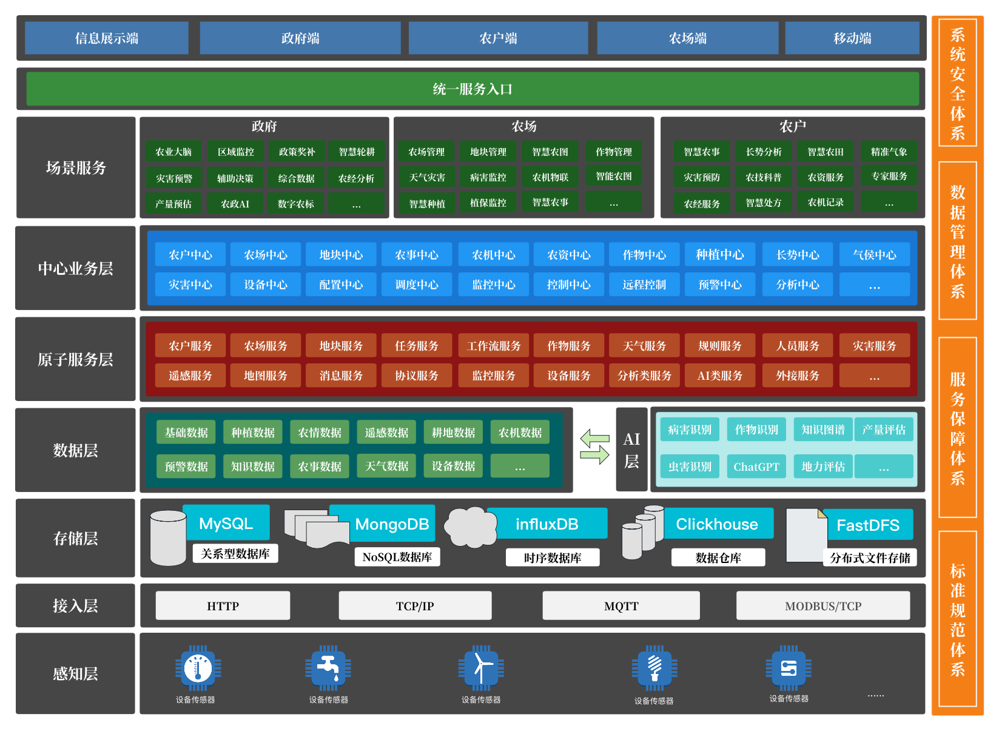
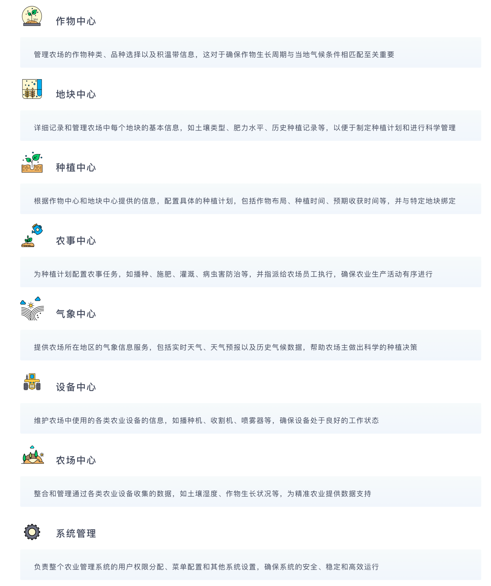
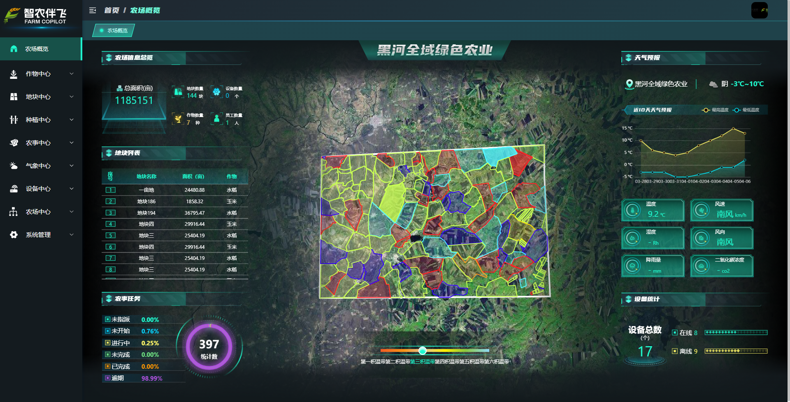
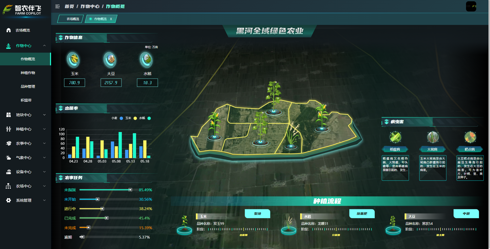
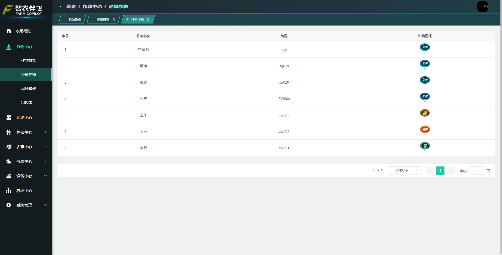
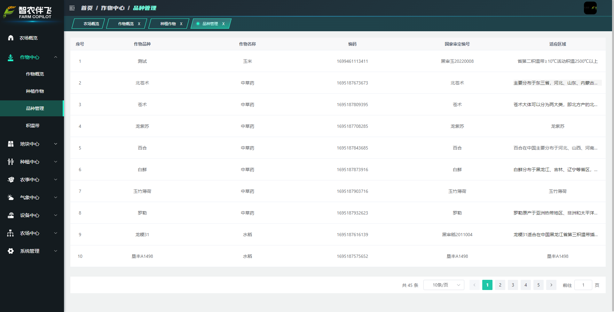
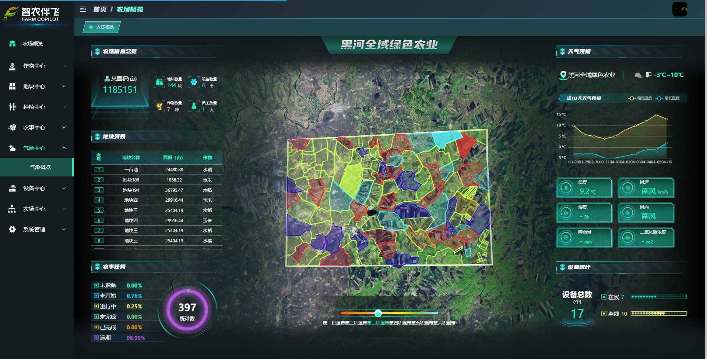

<h1 align="center" style="margin: 30px 0 30px; font-weight: bold;">智农伴飞开放平台</h1>
<h4 align="center" style="font-size: 18px;">基于SpringBoot+Vue前后端分离的智慧农业平台</h4>

## 系统简介
<p style="font-size: 20px;">&nbsp;&nbsp;&nbsp;&nbsp;&nbsp;&nbsp;&nbsp;智农伴飞开放平台，作为现代农业科技的集大成者，以其高效、精准和智能化的特点，正引领着农业生产的革新。该平台整合了作物中心、地块中心、种植中心、农事中心、气象中心、设备中心以及农场中心等多个功能模块，形成了一套完整的智慧农业管理体系。<p>
<p style="font-size: 20px;">&nbsp;&nbsp;&nbsp;&nbsp;&nbsp;&nbsp;&nbsp;在作物中心，用户能够轻松维护农作物和品种信息，并以作物为维度统计种植面积，形成全面的作物概览。同时，平台还提供积温带信息的维护功能，帮助用户更好地了解作物生长的环境条件。<p>
<p style="font-size: 20px;">&nbsp;&nbsp;&nbsp;&nbsp;&nbsp;&nbsp;&nbsp;地块中心则提供了地块信息的维护功能，用户可以通过可视化地块地图查看地块分布和状态。这大大提高了地块管理的便捷性和准确性，为种植计划的制定提供了有力支持。<p>
<p style="font-size: 20px;">&nbsp;&nbsp;&nbsp;&nbsp;&nbsp;&nbsp;&nbsp;种植计划模块允许用户维护计划模板，并下发种植计划。这确保了农业生产的有序进行，提高了生产效率。<p>
<p style="font-size: 20px;">&nbsp;&nbsp;&nbsp;&nbsp;&nbsp;&nbsp;&nbsp;农事中心则是一个记录所有农事操作的信息港，它确保了农业生产过程的可追溯性，为农业生产的精细化管理提供了可能。<p>
<p style="font-size: 20px;">&nbsp;&nbsp;&nbsp;&nbsp;&nbsp;&nbsp;&nbsp;气象中心实时监测气象情况，为用户提供准确的气象数据，帮助用户制定更为科学的种植决策。<p>
<p style="font-size: 20px;">&nbsp;&nbsp;&nbsp;&nbsp;&nbsp;&nbsp;&nbsp;设备中心以维护设备厂商、设备接入为主，并与地块结合，为用户提供设备分布及使用情况的概览。这有助于用户更好地管理农业设备，提高设备使用效率。<p>
<p style="font-size: 20px;">&nbsp;&nbsp;&nbsp;&nbsp;&nbsp;&nbsp;&nbsp;农场中心以维护农场、人员为主，确保农场运营的顺利进行。用户可以在此管理农场的基本信息、人员配置等，为农业生产的顺利进行提供有力保障。<p>
<p style="font-size: 20px;">&nbsp;&nbsp;&nbsp;&nbsp;&nbsp;&nbsp;&nbsp;智农伴飞开放平台以其全面的功能、精准的数据和智能化的管理，为现代农业的发展注入了新的活力。它不仅提高了农业生产的效率和质量，也为农业可持续发展提供了有力支持。<p>

<p align="center">

</p >

## 系统亮点
<p style="font-size: 20px;">
&nbsp;&nbsp;智能农场场景下的地块管理、农事管理、物联网设备接入、种植模板、农事计划。
</p>

## 运行环境
<p style="font-size: 20px;">
&nbsp;&nbsp;1. JDK 11 (推荐11) <br>
&nbsp;&nbsp;2. MySql 5.7.0 (推荐5.7版本)<br>
&nbsp;&nbsp;3. Redis 5.0<br>
&nbsp;&nbsp;4. RocketMq 4.4.0<br>
&nbsp;&nbsp;5. Maven 3.9<br>
&nbsp;&nbsp;6. VUE3 3.3.9<br>
</p>

## 核心配置
<p style="font-size: 20px;">
1. 代码克隆</br>
&nbsp;&nbsp;使用 IDEA 克隆 https://gitee.com/ai_5/agriculture-open 仓库的最新代码<br>
&nbsp;&nbsp;克隆完成后，耐心等待 Maven 下载完相关的依赖。一定要注意：<br>
2. MySQL初始化<br>
&nbsp;&nbsp;(1)创建一个项目数据库 执行目录下的SQL文件<br>
&nbsp;&nbsp;&nbsp;&nbsp;数据库表结构初始化 agriculture-open.sql<br>
&nbsp;&nbsp;(2)修改bootstrap-dev.yml 配置文件<br>
&nbsp;&nbsp;&nbsp;&nbsp;mysql配置在 bootstrap-dev.yml 文件中，需要修改以下配置：<br>
</p>

```
spring
    dynamic: # 多数据源配置
        druid: # Druid 【连接池】相关的全局配置
        initial-size: 5 # 初始连接数
        min-idle: 10 # 最小连接池数量
        max-active: 20 # 最大连接池数量
        max-wait: 600000 # 配置获取连接等待超时的时间，单位：毫秒
        time-between-eviction-runs-millis: 60000 # 配置间隔多久才进行一次检测，检测需要关闭的空闲连接，单位：毫秒
        min-evictable-idle-time-millis: 300000 # 配置一个连接在池中最小生存的时间，单位：毫秒
        max-evictable-idle-time-millis: 900000 # 配置一个连接在池中最大生存的时间，单位：毫秒
        validation-query: SELECT 1 FROM DUAL # 配置检测连接是否有效
        test-while-idle: true
        test-on-borrow: false
        test-on-return: false
        primary: master
        datasource:
            master:
                name: agriculture-open
                url: jdbc:mysql://xx.xx.xx.xx:xxxx/${spring.datasource.dynamic.datasource.master.name}?useSSL=false&allowPublicKeyRetrieval=true&useUnicode=true&characterEncoding=UTF-8&serverTimezone=GMT%2B8 # MySQL Connector/J 5.X 连接的示例
                username: xxx
                password: xxx
            slave: # 模拟从库，可根据自己需要修改
                name: agriculture-cloud-open
                url: jdbc:mysql://xx.xx.xx.xx:xxxx/${spring.datasource.dynamic.datasource.master.name}?useSSL=false&allowPublicKeyRetrieval=true&useUnicode=true&characterEncoding=UTF-8&serverTimezone=GMT%2B8 # MySQL Connector/J 5.X 连接的示例
                username: xxx
                password: xxx
```
<p style="font-size: 20px;">
3. redis配置 <br>
&nbsp;&nbsp;redis配置在 application-dev.yml 文件中
</p>

```
spring:
    redis:
        host: xx.xx.xx.xx # 地址
        port: 6379 # 端口
        database: 3 # 数据库索引
        password: xxx # 密码，建议生产环境开启
```
<p style="font-size: 20px;">
4. rocketmq<br>
&nbsp;&nbsp;rocketmq配置在 application-dev.yml 文件中
</p>

```
spring:
    cloud:
        stream:
        rocketmq:
        # RocketMQ Binder 配置项，对应 RocketMQBinderConfigurationProperties 类
        binder:
        name-server: xx.xx.xx.xx:xx # RocketMQ Namesrv 地址
```

<div style="font-size: 20px;">
5. 天气接口相关配置<br>
&nbsp;&nbsp;天气接口是通过象辑天气获取数据 象辑天气 http://gaofen.mlogcn.com/documentation/0/00 <br>
&nbsp;&nbsp;象辑配置在 application-dev.yml 文件中 修改象辑的 key
</div>

<p style="font-size: 20px;">
6. 后端编译过程
</p>
   (1）编译项目命令
    在项目 agriculture-open 执行命令：

```
mvn clean install -P dev
```

   (2) 编译结果 

```
   执行打包命令后 agriculture-open/agriculture-admin-server/target 目录生成 agriculture-admin-server.jar
```

   (3）启动项目
```
nohup java -jar agriculture-admin-server.jar &  
```
   (4）启动地址
```
启动完成后，使用浏览器访问 http://localhost:48083 后端项目启动在 48083 端口
```
<p style="font-size: 20px;">
7. 前端编译过程
</p>

```bash
# 进入项目目录
cd agriculture-ui

# 构建生产环境
yarn build:prod

# 构建测试环境
# yarn build:stage

# 打包在 dist 目录下
# dist目录结构
dist/                             打包后的输出目录
│
├── assets/                       打包后的静态资源、javascript文件、css文件等
├── favicon.ico/                  网站logo图标
├── index.html/                   打包后的主HTML文件
└── index.html.gz/                压缩后的主HTML文件
```

## 核心功能
<p align="center">
   
</p>

## 系统预览
<div align="center" width="90%" height="90%">
<table>
    <tr>
        <td></td>
        <td></td>
    </tr>
    <tr>
        <td></td>
        <td></td>
    </tr>
    <tr>
        <td></td>
        <td></td>
    </tr>
	<tr>
        <td></td>
        <td></td>
    </tr>	 
    <tr>
        <td></td>
        <td></td>
    </tr>
	<tr>
        <td></td>
        <td></td>
    </tr>
</table>
</div>

## 公众号
&nbsp;&nbsp;&nbsp; 

## 商务合作
<p style="font-size: 20px;">
&nbsp;&nbsp;哈尔滨工业大学人工智能研究院有限公司  18845086177  官网 https://www.airohit.com <br>
&nbsp;&nbsp;黑龙江省哈尔滨市松北区智谷大街288号深哈产业园B5-6栋6楼
</p>

## 使用须知
<p style="font-size: 20px;">
&nbsp;&nbsp;1. 允许用于个人学习、农业科研、智慧农业论证等公益事业;<br>
&nbsp;&nbsp;2. 如果商用必须保留版权信息，请自觉遵守;<br>
&nbsp;&nbsp;3. 禁止将本项目的代码和资源进行任何形式的出售，产生的一切任何后果责任由侵权者自负。
</p>

## 版权信息
<p style="font-size: 20px;">
&nbsp;&nbsp;本项目包含的第三方源码和二进制文件之版权信息另行标注。<br>
&nbsp;&nbsp;Copyright © 2021 哈尔滨工业大学人工智能研究院有限公司 (https://www.airohit.com)<br>
&nbsp;&nbsp;All rights reserved。<br>
&nbsp;&nbsp;智农伴飞® 商标和著作权所有者为哈尔滨工业大学人工智研究院所有。
</p>